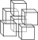
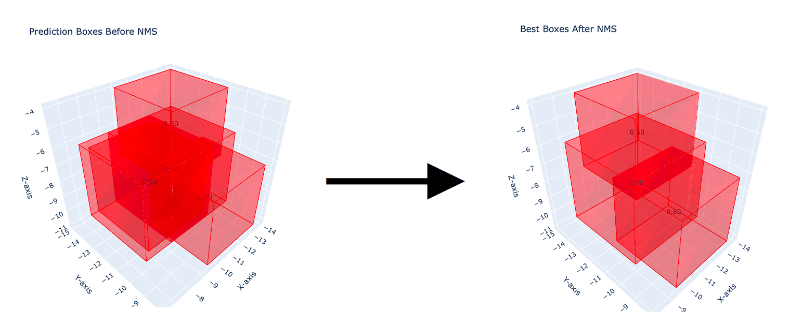

<div align="center">

  <!-- headline -->
  <center><h1> 3D Non-Maximum Suppression</h1></center>

  <!-- PyPI badge -->
  <a href="https://pypi.org/project/NMS-3D/">
    
  </a>

</div>

<br>

Implementation of 3D non-maximum suppression (NMS-3D) for bounding boxes using PyTorch and Plotly.



## ⬇️ Installation and Import
Now, this code is available with PyPI [here](https://pypi.org/project/nms-3d/). The package can be installed with:

```bash
pip install nms-3d
```

and can be imported as:

```python
import nms_3d
```


## 📂 Project Organization

The project consists of the following Python modules:
```bash
.
├── nms_3d/                # The NMS 3D package folder
│   ├── nms_3d.py          # Function that applies the NMS 3D algorithm.
│   └── plot_3d_boxes.py   # Function for creating 3D plots of bounding boxes using Plotly.
│
├── example.py             # The script that contains the 3D NMS application example.
│
├── bbox-coords/           # The folder that contains the bounding box .csv files before and after the 3D NMS.
│   ├── bbox-coords-before-nms-3d.csv  # Example file of bounding boxes to suppress.
│   └── bbox-coords-after-nms-3d.csv   # Output file after applying the 3D NMS on bbox-coords-before-nms-3d.csv.
│
└── output/                # The folder that contains the .html visualization of the boxes before and after the 3D NMS.
    ├── best_boxes_after_nms.html   # .html view of the boxes after the 3D NMS.
    ├── best_boxes_before_nms.html  # .html view of the boxes before the 3D NMS.
    └── NMS-image-example.png       # Example image used in this README.md file.
```

Run the application example with:

```bash
python3 example.py
```

This code will read the bounding box coordinates from bbox-coords-before-nms-3d.csv, perform 3D NMS, and save the result to bbox-coords-after-nms-3d.csv. Also, two 3D plots are saved as HTML files to show the boxes before and after NMS.

## 🚨 Requirements

```bash
Python>=3.8.0
torch>=2.2.2
plotly>=5.13.1
```

Install the requirements with:
```bash
pip3 install -r requirements.txt
```

## 📦 Package documentation

Package documentation is available [here](https://giuliorusso.github.io/NMS-3D/).

### `nms_3d`

Apply 3‑D Non‑Maximum Suppression (NMS) to a set of scored axis‑aligned boxes.
The function keeps the highest‑scoring box, removes all boxes whose IoU with it
exceeds a chosen threshold, then repeats until no boxes remain.

```python
nms_3d(
    prediction_boxes: torch.Tensor,
    iou_threshold: float = 0.5,
    debug: bool = False
) -> torch.Tensor
```

#### Parameters

| Name               | Type           | Description                                                                   |
| ------------------ | -------------- | ----------------------------------------------------------------------------- |
| `prediction_boxes` | `torch.Tensor` | Shape **(N, 7)**. Columns: `SCORE, X_MIN, Y_MIN, Z_MIN, X_MAX, Y_MAX, Z_MAX`. |
| `iou_threshold`    | `float`        | IoU cutoff for suppression (`0‒1`). Default **0.5**.                          |
| `debug`            | `bool`         | If **True**, prints each suppression step.                                    |

#### Returns

`torch.Tensor` – The retained boxes after NMS, shape **(M, 7)** where **M ≤ N**.

#### Example

```python
import torch
from nms_3d import nms_3d

prediction_boxes = torch.tensor([
    [0.95, 10, 10, 10, 20, 20, 20],  # kept
    [0.90, 12, 12, 12, 22, 22, 22],  # suppressed (overlaps first)
    [0.85, 50, 50, 50, 60, 60, 60],  # kept
    [0.80, 55, 55, 55, 65, 65, 65],  # suppressed (overlaps third)
    [0.75,100,100,100,110,110,110]   # kept
])

filtered = nms_3d(
    prediction_boxes=prediction_boxes,
    iou_threshold=0.5,
    debug=True
)
print(filtered)
```

---

### `plot_3d_boxes`

Visualise axis‑aligned 3‑D bounding boxes with Plotly and (optionally) save the interactive scene to HTML.

```python
plot_3d_boxes(
    boxes: torch.Tensor,
    title: str = "Plot 3D boxes",
    save_html: bool = False,
    html_filename_path: str | None = "./plot_3d_boxes.html",
    color: tuple[int, int, int] = (255, 0, 0),
    show_scores: bool = True
) -> None
```

#### Parameters

| Name                 | Type                 | Description                                                                                  |
| -------------------- | -------------------- | -------------------------------------------------------------------------------------------- |
| `boxes`              | `torch.Tensor`       | Shape **(N, 7)** – columns: `SCORE, X_MIN, Y_MIN, Z_MIN, X_MAX, Y_MAX, Z_MAX`.               |
| `title`              | `str`                | Window title for the Plotly figure.                                                          |
| `save_html`          | `bool`               | **True** → write the figure to `html_filename_path`; **False** → open an interactive window. |
| `html_filename_path` | `str`                | Output path for the `.html` file (used when `save_html=True`).                               |
| `color`              | `tuple[int,int,int]` | RGB triplet for box edges/faces.                                                             |
| `show_scores`        | `bool`               | Display each box’s confidence score at its centroid.                                         |

#### Returns

`None` – renders the figure or writes it to disk.

#### Example

```python
import torch
from nms_3d.plot_3d_boxes import plot_3d_boxes

boxes = torch.tensor([
    [0.95, 10, 10, 10, 20, 20, 20],
    [0.85, 30, 30, 30, 40, 40, 40],
    [0.75, 50, 50, 50, 60, 60, 60]
])

plot_3d_boxes(
    boxes=boxes,
    title="Bounding Boxes",
    save_html=True,
    html_filename_path="./boxes.html",
    color=(0, 255, 0),
    show_scores=True
)
```

## 🤝 Contribution
👨‍💻 [Ciro Russo, PhD](https://www.linkedin.com/in/ciro-russo-b14056100/)

## ⚖️ License

MIT License
