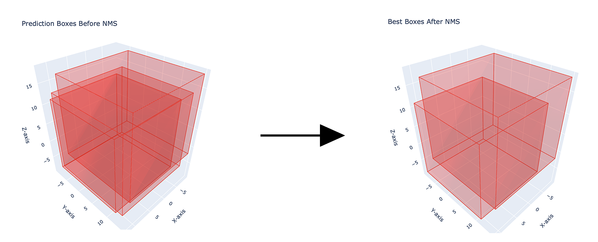

# 3D Non-Maximum Suppression

This is an example implementation of 3D non-maximum suppression (NMS) for bounding boxes using PyTorch and Plotly.

## Files

The project consists of the following components:

- **NMS-3D.py**: The main script containing the 3D NMS function and an application example
    - **plot_3d_boxes**: function for creating 3D plots of bounding boxes using Plotly.
    - **nms_3d**: function that apply the NMS 3D algorithm
    - **main**: starting point of the script using a .csv example

- **bbox-coords-before-nms-3d.csv**: example file of bounding boxes to suppress.
- **bbox-coords-after-nms-3d.csv**: output file after the application of the 3D NMS on bbox-coords-before-nms-3d.csv file.
- **best_boxes_after_nms.html**: .html view of the boxes after the 3D NMS.
- **best_boxes_after_nms.html**: .html view of the boxes before the 3D NMS.

## Requirements

- Python 3.x
- Pandas
- Torch
- Plotly

## Run

Run the main() function in NMS-3D.py with:

    python3 NMS-3D.py

This will read the bounding box coordinates from bbox-coords-before-nms-3d.csv, perform 3D NMS, and save the result to bbox-coords-after-nms-3d.csv. Also, two 3D plots are saved as HTML files to show the boxes before and after NMS.

## Acknowledgments

This project is a basic example of 3D NMS and can be used as a starting point for more complex applications.
