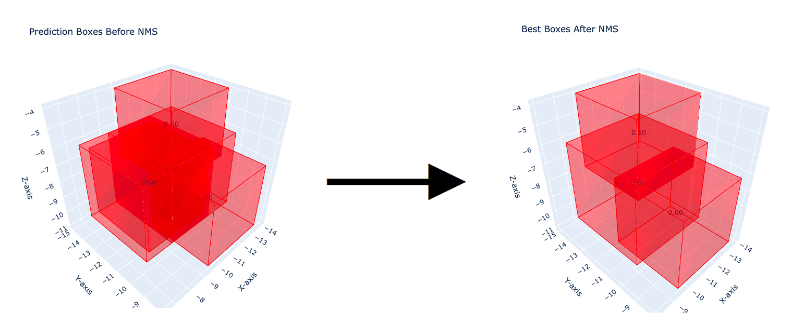

# 3D Non-Maximum Suppression

This is an example implementation of 3D non-maximum suppression (NMS-3D) for bounding boxes using PyTorch and Plotly.

## File organization

The project consists of the following Python scripts:

- **main.py**: The main script containing the 3D NMS application example
- **nms_3d.py**: The 3D Non-Maximum Suppression module containing:
    - **plot_3d_boxes**: function for creating 3D plots of bounding boxes using Plotly.
    - **nms_3d**: function that apply the NMS 3D algorithm

The following .csv and .html files are used for the application example in main.py:

- **bbox-coords**: The folder that contains the boundig box .csv files before and after the 3D Non-Maximum Suppression.
    - **bbox-coords-before-nms-3d.csv**: example file of bounding boxes to suppress.
    - **bbox-coords-after-nms-3d.csv**: output file after the application of the 3D NMS on bbox-coords-before-nms-3d.csv file.

- **output**: The folder that cointains the .html visualization of the boxes before and after the 3D Non-Maximum Suppression.
    - **best_boxes_after_nms.html**: .html view of the boxes after the 3D NMS.
    - **best_boxes_after_nms.html**: .html view of the boxes before the 3D NMS.
    - **NMS-image-example.png**: example image used in this README.md file

## Requirements

- Python 3.x
- Pandas
- Torch
- Plotly

## Run

Run the application example with:

    python3 main.py

This code will read the bounding box coordinates from bbox-coords-before-nms-3d.csv, perform 3D NMS, and save the result to bbox-coords-after-nms-3d.csv. Also, two 3D plots are saved as HTML files to show the boxes before and after NMS.

## Acknowledgments

This project is a basic example of 3D NMS and can be used as a starting point for more complex applications that requires this post-processing techniques.
