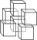
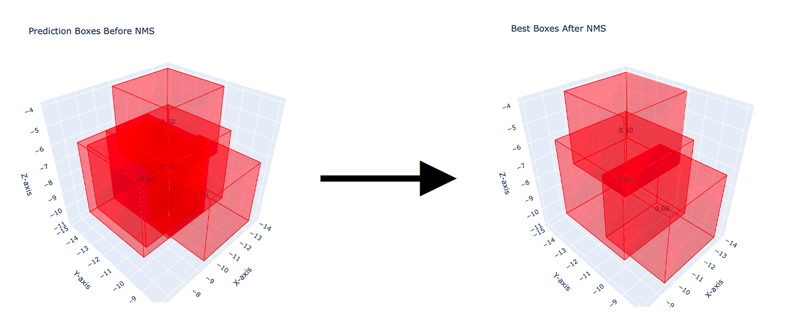

  <!-- headline -->
  
<h1> 3D Non-Maximum Suppression</h1>

  <!-- PyPI badge -->
  

 

Implementation of 3D non-maximum suppression (NMS-3D) for bounding boxes using PyTorch and Plotly.

Official GitHub repository available [here](https://github.com/GiulioRusso/NMS-3D).  

## 👨‍💻 Authors
- [Giulio Russo](https://www.linkedin.com/in/russogiulio/)
- [Ciro Russo, PhD](https://www.linkedin.com/in/ciro-russo-b14056100/)

## ⚖️ License

MIT License

